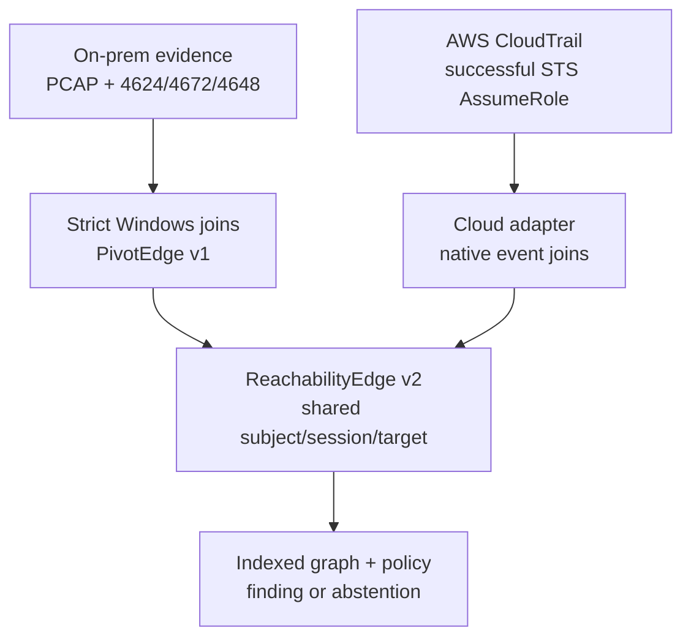

# Architecture: Evidence → Edge → Context → Progression

Single-host detections can see a privileged logon, but not whether that session
created a new path, crossed an administrative boundary, or expanded access
toward critical assets. This portfolio reconstructs that progression from
evidence-supported edges and now uses a v2 vocabulary that can represent both
on-premises and AWS activity without erasing platform-native proof.



## Contracts

The layers speak through schemas in `schemas/`, so adapters can evolve without
breaking existing consumers:

```text
Windows evidence → PivotEdge v1 ┐
                                ├→ ReachabilityEdge v2
AWS CloudTrail ─────────────────┘

PivotEdge v1 → ProgressionFinding (current bounded classifier)
```

`PivotEdge` v1 is intentionally retained. `ReachabilityEdge` v2 adds
platform-neutral entities, sessions, transition state, and evidence references.
`validate_schemas.py` checks the schemas and Windows scenarios;
`test_hybrid_reachability.py` validates both adapters.

## Division of labour

| Stage | Where | Responsibility |
|---|---|---|
| Telemetry | `sensor/` · Windows Security · AWS CloudTrail | captured network, authentication, session, and cloud-management evidence |
| Windows edge | Elastic edge *candidate* rule + `materialize_pivot_edges.py` | enforce service/LogonType compatibility, IP and logon-ID joins, 4648 on the outgoing hop, and session lineage |
| Hybrid adapter | `hybrid_reachability.py` | lift PivotEdge v1 and materialize successful CloudTrail AssumeRole events into v2 without name/time-based identity inference |
| Context | `automation/context/` | tiers, roles, sanctioned paths, policy scope, approvals, and known reachability |
| Graph + finding | `build_reachability_graph.py` · `classify_pivot_progression.py` | compose compatible edges and classify or abstain |

## The rule that pierces the blind spot

Entitlement and route authorization are independent facts:

```text
identity_entitled_to_tier0 = true
route_policy_state         = PROHIBITED
target_critical            = true
→ CRITICAL_UNAPPROVED_PATH
```

A Domain Admin entitled to Tier 0 who reaches a DC by a prohibited route is
still critical. The policy decision is three-state: `AUTHORIZED`, `PROHIBITED`,
or `UNKNOWN_CONTEXT`. An absent allow-list entry becomes `PROHIBITED` only when
the policy is active and declares itself complete for that environment,
identity, and target tier. Otherwise the classifier abstains.

## Honest boundaries

- **Edge materialization is implemented.** Strict Windows joins are exercised
  end-to-end by `automation/test_pipeline.py`. Native EVTX/Elastic-export
  ingestion and real PCAP replay are implemented by `evidence_io.py` and
  `reconstruct_case.py`. Live Elastic rule import and ES|QL execution remain
  outside CI.
- **The AWS slice is deliberately narrow.** It currently materializes successful
  `sts:AssumeRole`; it does not yet model every cloud service or workload plane.
- **Bounded, not a full graph engine.** The current classifier evaluates two-hop
  PivotEdge v1 progression. ReachabilityEdge v2 establishes the hybrid contract
  and adapters; arbitrary-length hybrid FIRE reasoning remains future work.
- **Batch latency, not real-time latency.** `reconstruct_case.py` measures each
  offline stage and the total pipeline. A stateful streaming deployment can use
  the same edge contracts, but is not implemented or claimed here.
- **No ML in the evidence path.** Deterministic joins and explicit policy make
  the examiner's result re-derivable. ML may prioritize confirmed findings only.
