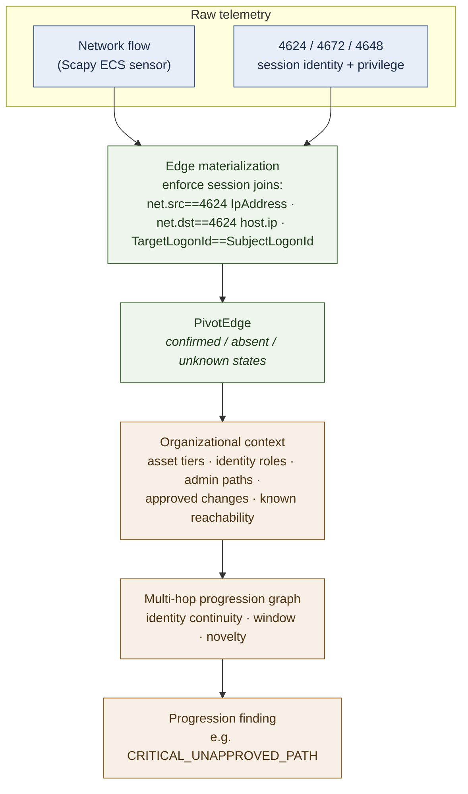

# Architecture: Edge → Context → Graph → Progression

Single-host detections can see a privileged logon, but not whether that session
*created a new path*, *crossed an administrative boundary*, or *expanded access
toward critical assets*. This portfolio reconstructs that progression in four
stages: raw telemetry becomes a trustworthy **edge**, the edge is judged against
organisational **context**, edges compose into a reachability **graph**, and the
graph yields a **progression finding**.



## Contracts (frozen first)

The layers speak through frozen schemas in `schemas/`, so logic can be rewritten
without destabilising the format:

```
Raw telemetry → PivotEdge → ProgressionFinding
```

`validate_schemas.py` checks every edge fixture against `pivot_edge.schema.json`;
`validate_context.py` checks context structure and referential integrity.

## Division of labour

| Stage | Where | Responsibility |
|---|---|---|
| Telemetry | `sensor/` | ECS network flows |
| Edge | Elastic edge *candidate* rule + `materialize_pivot_edges.py` | one trustworthy pivot edge with enforced session joins (service/LogonType compat, IP + logon-id joins, 4648 on the outgoing hop, session lineage) |
| Context | `automation/context/` | tiers, roles, sanctioned paths, approvals, known reachability |
| Graph + finding | `build_reachability_graph.py` · `classify_pivot_progression.py` | compose edges, classify progression |

## The rule that pierces the blind spot

Entitlement and route authorization are independent facts:

```
identity_entitled_to_tier0 = true
route_authorized           = false
target_critical            = true
→ CRITICAL_UNAPPROVED_PATH
```

A Domain Admin entitled to Tier 0 who reaches a DC by an unapproved route is
still critical. That separation is what earlier single-hop framing missed.

## Honest boundaries

- **Edge materialization is implemented** (`materialize_pivot_edges.py`) and the
  strict session joins are enforced and exercised end-to-end by
  `automation/test_pipeline.py` (pcap → sensor → materializer → graph → finding).
  The EQL rule remains an edge *candidate* generator; the materializer is what
  makes an edge trustworthy. Live Elastic import/ES|QL execution is the only step
  still outside CI (no stack in the sandbox).
- **Bounded, not a full graph engine** — arbitrary-length reachability is the FIRE
  engine; this shows a verified bounded slice and points to FIRE for the general case.
