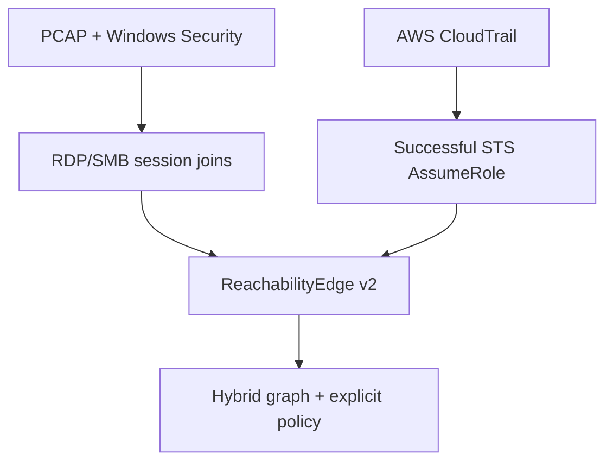

# Hybrid on-premises and AWS reachability

The unified model is an evidence vocabulary, not a claim that Windows and cloud
sessions expose identical telemetry. Each platform keeps its native evidence
rules and is lifted into `ReachabilityEdge` v2 only after those rules hold.

## Common contract, platform-native proof

| Shared concept | On premises | AWS |
|---|---|---|
| Subject | Windows identity | IAM/STS principal ARN |
| Source | Origin host | Calling principal |
| Target | Destination host | Assumed role ARN |
| Session | Target Logon ID; optional source Logon ID lineage | Issued access-key ID or assumed-role session ID |
| Transition proof | Correlated Event 4648 and session lineage | Successful CloudTrail `sts:AssumeRole` response |
| Native evidence | Flow + 4624; 4672 for privilege; 4648 for explicit credentials | CloudTrail event ID, actor, requested role, and returned session |
| Privilege | Confirmed only from session evidence | `unknown` in the adapter; criticality/authorization belongs to policy |

The v2 record uses namespaced identifiers such as
`identity:on_prem:CORP\alice`, `host:on_prem:WS-ENG-12`, and
`role:aws:arn:aws:iam::444455556666:role/SecurityAudit`. Platform-specific fields
remain under `native_context`; evidence references include the source event ID
and input SHA-256 where available.

## Cross-environment identity continuity

The adapter never joins a Windows identity to a cloud principal merely because
the username, time, or source IP looks similar. A bridge becomes `confirmed`
only when an examiner supplies an exact mapping with its own evidence reference,
for example a reviewed identity-governance record. Without that mapping the
state is `unknown`, and downstream logic must abstain from asserting one person's
continuous path.

## Route policy and entitlement

Cloud or on-premises entitlement answers whether the subject may reach a target.
Route policy answers whether the observed sequence used the sanctioned path.
The policy decision must remain three-state:

| State | Required basis | Result |
|---|---|---|
| `AUTHORIZED` | Active policy explicitly matches the observed route | Expected route |
| `PROHIBITED` | Active policy is declared complete for the scope and no approved route matches | Unauthorized-path finding may be asserted |
| `UNKNOWN_CONTEXT` | Policy is absent, expired, or incomplete for the scope | Document and abstain |

## Latency and ML boundary

The implemented runner is offline batch reconstruction. It records time spent in
network ingestion, Windows ingestion, edge materialization, graph/classification,
derived-output writing, and the overall pipeline. This makes latency measurable
without overstating real-time capability.

A lower-latency deployment would keep per-session join state, watermark late
events, materialize immutable edges as evidence arrives, and incrementally update
the graph. That is a deployment refactor around the same contracts, not a reason
to replace the core with machine learning.

ML can optionally rank confirmed findings after reconstruction. It must not
create an edge, infer a cross-environment identity bridge, upgrade ambiguous
evidence, or convert incomplete policy into prohibition. This preserves the
examiner's ability to re-derive every substantive claim.

## Current proof-of-concept boundary

- On premises: RDP/SMB from PCAP plus Windows 4624/4672/4648.
- AWS: successful management-event `sts:AssumeRole` from CloudTrail JSON,
  NDJSON, EventBridge detail, or Elasticsearch `_search` exports.
- The current two-hop progression classifier still consumes PivotEdge v1.
  ReachabilityEdge v2 establishes the hybrid contract and tested adapters; an
  arbitrary-length hybrid FIRE engine remains future work.
